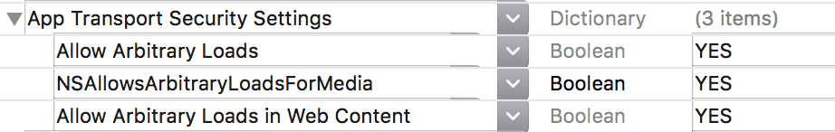
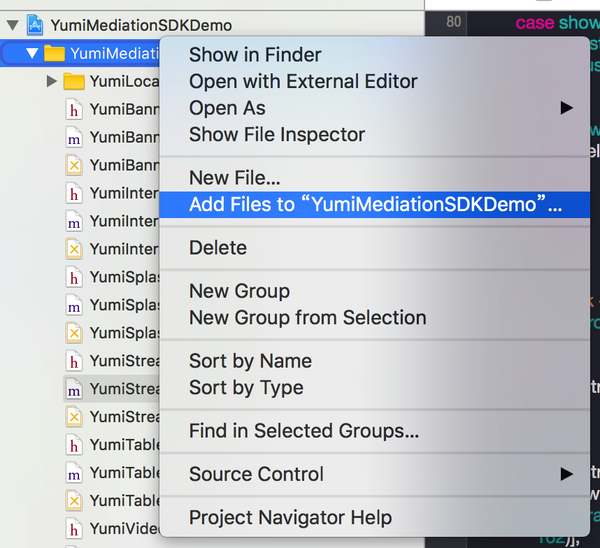
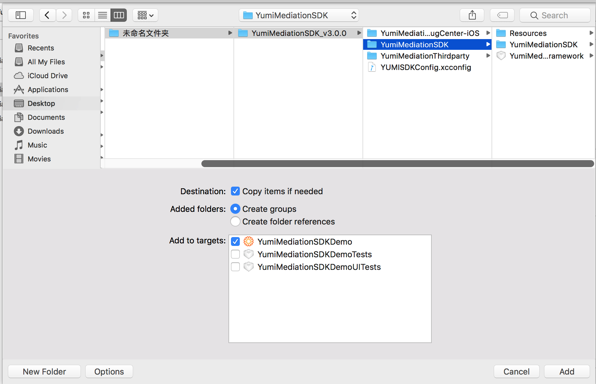
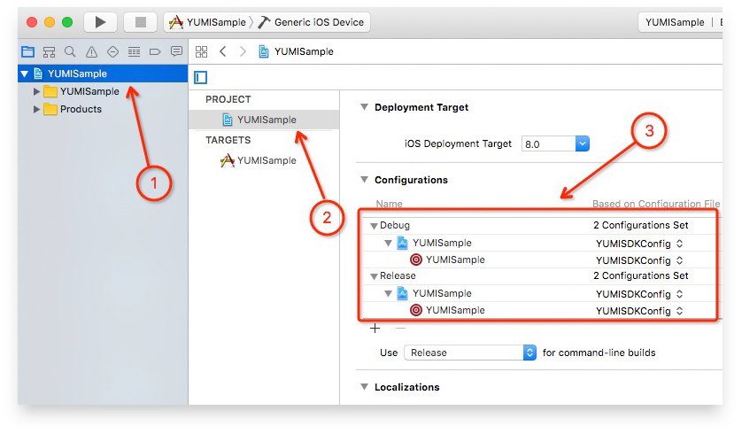
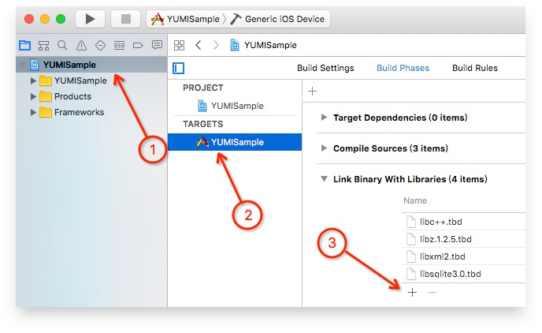
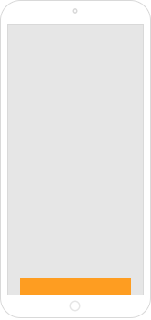
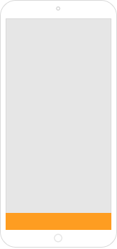
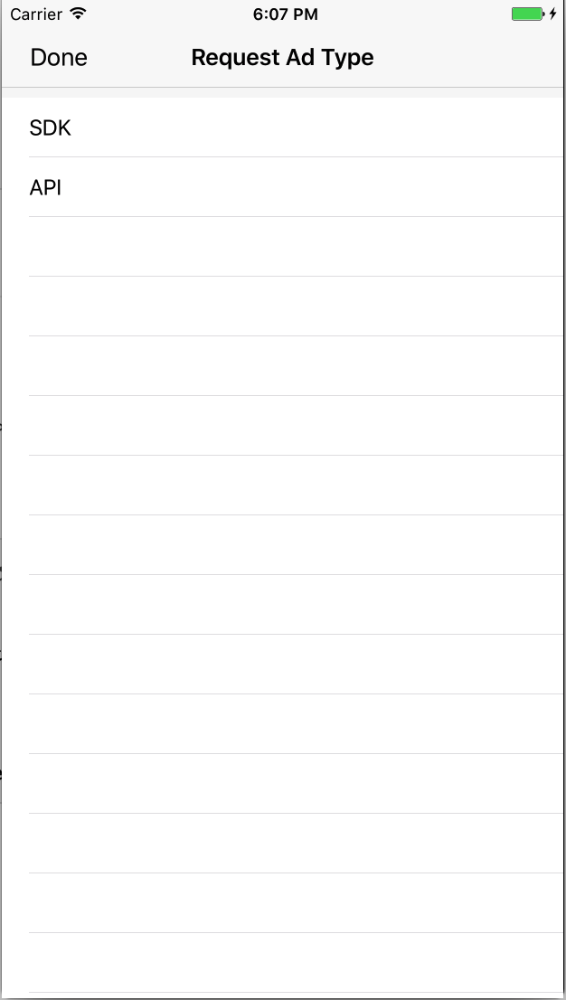
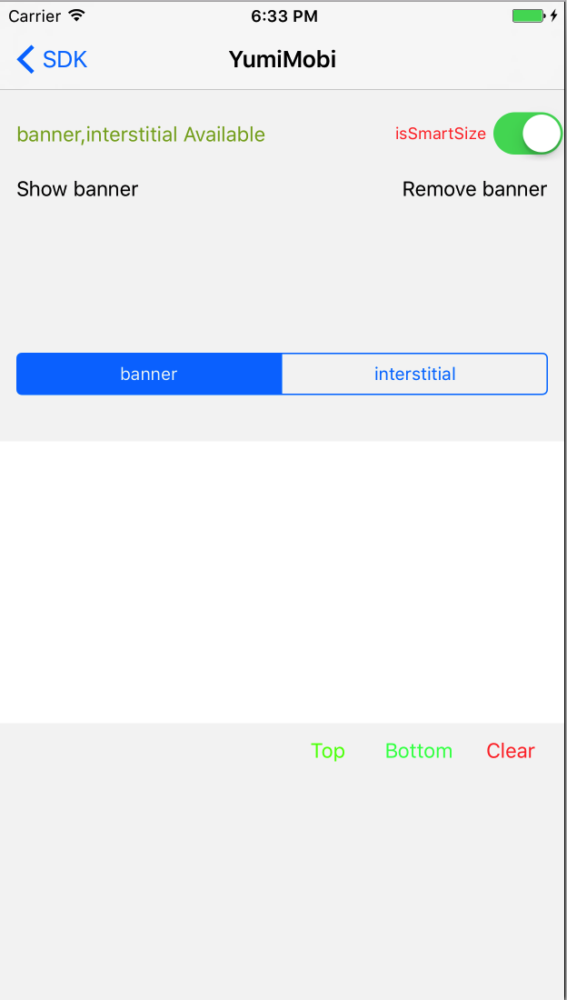

[TOC]

# YumiMediationSDK iOS

## Summary

1. To Readers

This documentation is intended for developers who want to integrate Yumimobi SDK in IOS products.

2. Develop Environment

Xcode 7.0 and above.

iOS 8.0 and above.

3. [ Get Demo ](https://github.com/yumimobi/YumiMediationSDKDemo-iOS/tree/branch_3.0.0)

## Develop Encironment Configuration

### App Transport Security

ATS (App Transport Security) proposed by WWDC 15 features an important method for Apple to boost network communication security. Non-HTTPS access will be banned by default for ios 9 and later.

As most of materials are provided by HTTP, please set as the followings to improve fillrate：

```objective-c
<key>NSAppTransportSecurity</key>
<dict>
<key>NSAllowsArbitraryLoads</key>
<true/>
<key>NSAllowsArbitraryLoadsForMedia</key>
<true/>
<key>NSAllowsArbitraryLoadsInWebContent</key>
<true/>
</dict>
```



### Permissions for ios 9 and later

Upload app to App Store, and add the following peimissions to info.plist.

```objective-c
<-- Calendar -->
<key>NSCalendarsUsageDescription</key>
<string>App shall access calendar with your permission</string>
<!-- Photos -->
<key>NSPhotoLibraryUsageDescription</key>
<string>App shall access photos with your permission</string>
```
## Integration Method

1. CocoaPods ( recommend )

CocoaPods is a dependency manager for ios, which will make it easy to manage YumiMediationSDK.

Open Podfile, add one of the following methods to target.

If use CocoaPods for the first time, please view [CocoaPods Guides](https://guides.cocoapods.org/using/using-cocoapods.html).

1. If need YumiMediationSDK only:

```ruby
pod "YumiMediationSDK"
```

2. If also need other platforms:

```ruby
pod "YumiMediationAdapters", :subspecs => ['AdColony','AdMob','AppLovin','Baidu','Chartboost','Domob','Facebook','GDT','InMobi','IronSource','StartApp','Unity','Vungle','AdNative']
```

Then run the followings at command line interface:

```ruby
$ pod install --repo-update
```

Finally, open project by workspace.

2. Manually Integrating YumiMediationSDK

1. Choose third-party SDK

2. Download third-party SDK

3. Download YumiMediationSDK

4. Add YumiMediationSDK to your project





5. Script configuration

Add YUMISDKConfig according to steps as shown.



6. Import Framework

Import system dynamic libraries as shown.



## Code Sample

### Advertisement Forms

#### Banner

##### Initialization and banner request

```objective-c
#import <YumiMediationSDK/YumiMediationBannerView.h>

@interface ViewController ()<YumiMediationBannerViewDelegate>
@property (nonatomic) YumiMediationBannerView *yumiBanner;
@end

@implementation ViewController

//init yumiBanner
- (void)viewDidLoad {
[super viewDidLoad];
self.yumiBanner = [[YumiMediationBannerView alloc] initWithYumiID:@"Your YumiID"                                                             channelID:@"Your ChannelID"
versionID:@"Your VersionNumber"                                                                                                           position:YumiMediationBannerPositionBottom
rootViewController:self];
self.yumiBanner.delegate = self;
[self.yumiBanner loadAd:YES];
[self.view addSubview:self.yumiBanner];
}
@end
```

##### Remove banner

```objective-c
//remove yumiBanner
- (void)viewWillDisappear:(BOOL)animated {
[super viewWillDisappear:animated];
if (_yumiBannerView) {
[_yumiBannerView removeFromSuperview];
_yumiBannerView = nil;
}
}
```

##### Delegate implementation

```objective-c
//implementing yumiBanner delegate
- (void)yumiMediationBannerViewDidLoad:(YumiMediationBannerView *)adView{
NSLog(@"adViewDidReceiveAd");
}
- (void)yumiMediationBannerView:(YumiMediationBannerView *)adView didFailWithError:(YumiMediationError *)error{
NSLog(@"adView:didFailToReceiveAdWithError: %@", error);
}
- (void)yumiMediationBannerViewDidClick:(YumiMediationBannerView *)adView{
NSLog(@"adViewDidClick");
}
```

##### Self-adaptation

```objective-c
- (void)loadAd:(BOOL)isSmartBanner;
```

You are available to set whether to turn on self-adaptation when making `banner` request.

If `isSmartBanner` is `YES` ,YumiMediationBannerView will automatically adapt to size of device.

You are supported to get size of YumiMediationBannerView by the following method.

```objective-c
- (CGSize)fetchBannerAdSize;
```

 

​    *non self-adaptation mode*             *self-adaptation mode*
​    
​    #### Interstitial
​    
​    ##### Initialization and interstitial request
​    
​    ```objective-c
​    #import <YumiMediationSDK/YumiMediationInterstitial.h>
​    
​    @interface ViewController ()<YumiMediationInterstitialDelegate>
​    @property (nonatomic) YumiMediationInterstitial *yumiInterstitial;
​    @end
​    
​    @implementation ViewController
​    //init yumiInterstitial
​    - (void)viewDidLoad {
​    [super viewDidLoad];
​    self.yumiInterstitial =  [[YumiMediationInterstitial alloc]
​    initWithYumiID:@"Your YumiID"
​    channelID:@""
​    versionID:@""
​    rootViewController:self];
​    self.yumiInterstitial.delegate = self;
​    }
​    @end
​    ```
​    
​    ##### Show Interstitial
​    
​    ```objective-c
​    //present YumiMediationInterstitial
​    - (IBAction)presentYumiMediationInterstitial:(id)sender {
​    if ([self.yumiInterstitial isReady]) {
​    [self.yumiInterstitial present];
​    } else {
​    NSLog(@"Ad wasn't ready");
​    }
​    }
​    ```
​    
​    ##### Delegate implementation
​    
​    ```objective-c
​    //implementing YumiMediationInterstitial Delegate
​    - (void)yumiMediationInterstitialDidReceiveAd:(YumiMediationInterstitial *)interstitial{
​    NSLog(@"interstitialDidReceiveAd");
​    }
​    - (void)yumiMediationInterstitial:(YumiMediationInterstitial *)interstitial
​    didFailWithError:(YumiMediationError *)error{
​    NSLog(@"interstitial:didFailToReceiveAdWithError: %@", error)
​    }
​    - (void)yumiMediationInterstitialWillDismissScreen:(YumiMediationInterstitial *)interstitial{
​    NSLog(@"interstitialWillDismissScreen");
​    }
​    - (void)yumiMediationInterstitialDidClick:(YumiMediationInterstitial *)interstitial{
​    NSLog(@"interstitialDidClick");
​    }
​    ```
​    
​    #### Rewarded Video
​    
​    ##### Initialization and rewarded video request
​    
​    ```objective-c
​    #import <YumiMediationSDK/YumiMediationVideo.h>
​    
​    @implementation ViewController
​    - (void)viewDidLoad {
​    [super viewDidLoad];
​    [[YumiMediationVideo sharedInstance] loadAdWithYumiID:@"Your YumiID"
​    channelID:@"Your ChannerID"
​    versionID:@"Your VersionNumber"];
​    [YumiMediationVideo sharedInstance].delegate = self;
​    }
​    @end
​    ```
​    
​    ##### Show rewarded video
​    
​    ```objective-c
​    - (IBAction)presentYumiMediationVideo:(id)sender {
​    if ([[YumiMediationVideo sharedInstance] isReady]) {
​    [[YumiMediationVideo sharedInstance] presentFromRootViewController:self];
​    } else {
​    NSLog(@"Ad wasn't ready");
​    }
​    }
​    ```
​    
​    ##### Delegate implementation
​    
​    ```objective-c
​    - (void)yumiMediationVideoDidOpen:(YumiMediationVideo *)video{
​    NSLog(@"Opened reward video ad.");
​    }
​    - (void)yumiMediationVideoDidStartPlaying:(YumiMediationVideo *)video{
​    NSLog(@"Reward video ad started playing.");
​    }
​    - (void)yumiMediationVideoDidClose:(YumiMediationVideo *)video{
​    NSLog(@"Reward video ad is closed.");
​    }
​    - (void)yumiMediationVideoDidReward:(YumiMediationVideo *)video{
​    NSLog(@"is Reward");
​    }
​    ```
​    
​    #### Splash
​    
​    ##### Initialization and splash request
​    
​    To ensure splash impression, it is recommended to operate as the followings when App launching.
​    
​    for example：in your `AppDelegate`  `application:didFinishLaunchingWithOptions:`
​    
​    ```objective-c
​    #import <YumiMediationSDK/YumiAdsSplash.h>
​    ```
​    
​    ```objective-c
​    [[YumiAdsSplash sharedInstance] showYumiAdsSplashWith:@"Your YumiID" rootViewController:self.window.rootViewController delegate:self]
​    ```
​    
​    ##### Delegate implementation
​    
​    ```objective-c
​    - (void)yumiAdsSplashDidLoad:(YumiAdsSplash *)splash{
​    NSLog(@"yumiAdsSplashDidLoad.");
​    }
​    - (void)yumiAdsSplash:(YumiAdsSplash *)splash DidFailToLoad:(NSError *)error{
​    NSLog(@"yumiAdsSplash:DidFailToLoad: %@", error)
​    }
​    - (void)yumiAdsSplashDidClicked:(YumiAdsSplash *)splash{
​    NSLog(@"yumiAdsSplashDidClicked.");
​    }
​    - (void)yumiAdsSplashDidClosed:(YumiAdsSplash *)splash{
​    NSLog(@"yumiAdsSplashDidClosed.");
​    }
​    - (nullable UIImage *)yumiAdsSplashDefaultImage{
​    return UIImage;//Your default image when app start
​    }
​    ```
​    
​    #### Native
​    
​    ##### Initialization and information stream request
​    
​    ```objective-c
​    #import <YumiMediationSDK/YUMIStream.h>
​    #import <YumiMediationSDK/YUMIStreamCustomView.h>
​    #import <YumiMediationSDK/YUMIStreamModel.h>
​    
​    @interface ViewController ()<YUMIStreamDelegate,YMAdCustomViewDelegate>
​    @property (nonatomic) YUMIStream *yumiStream;
​    @property (nonatomic) YUMIStreamCustomView *yumiCustomView;
​    @property (nonatomic, assign) NSUInteger yumiStreamNumber;
​    @end
​    
​    @implementation ViewController
​    - (void)viewDidLoad {
​    [super viewDidLoad];
​    self.yumiStream = [[YUMIStream alloc] initWithYumiID:@"Your YumiID"
​    channelID:@"Your ChannelID"
​    versionID:@"Your VersionNumber"];
​    self.yumiStream.delegate = self;
​    [self.stream loadStream];
​    }
​    @end
​    
​    ```
​    
​    ##### Show information stream
​    
​    ```objective-c
​    - (IBAction)present:(id)sender {
​    if (![yumiStream isExistStream]) {
​    return;
​    }
​    YUMIStreamModel *sModel = [_stream getStreamModel];
​    //You are supported to select two showing modes.
​    //showOfView: return material; showOfData: return view（material loaded already）
​    switch (sModel.showType) {
​    case showOfData: {
​    self.customView.streamModel = sModel;
​    [self.customView loadHTMLString:[self streamHtmlWithStreamModel:sModel]];
​    break;
​    }
​    case showOfView:
​    [sModel reloadWebview];
​    break;
​    default:
​    break;
​    }
​    }
​    //If choose showOfData, you are required to use YUMIStreamCustomView to load html.
​    - (YUMIStreamCustomView *)customView {
​    if (!_customView) {
​    _customView =[[YUMIStreamCustomView alloc] initWithCustomView:
​    CGRectMake((self.view.frame.size.width - 320) / 2,
​    self.view.frame.size.height - 50, 320, 50)
​    clickType:CustomViewClickTypeOpenSystem
​    delegate:self];
​    }
​    
​    return _customView;
​    }
​    //If choose showOfData, you are available to choose the html template we provided, or process by yourself.
​    - (NSString *)streamHtmlWithStreamModel:(YUMIStreamModel *)smodel {
​    NSBundle *bundle =[NSBundle bundleWithPath:[[NSBundle mainBundle]
​    pathForResource:@"YumiMediationSDK" ofType:@"bundle"]];
​    NSString *path = [bundle pathForResource:@"stream320x50_icon" ofType:@"html"];
​    NSData *data = [NSData dataWithContentsOfFile:path];
​    NSString *streamHtml = [[NSString alloc] initWithData:data
​    encoding:NSUTF8StringEncoding];
​    streamHtml = [NSString stringWithFormat:streamHtml, @"100%", @"100%", @"100%", @"76%",
​    smodel.iconUrl, smodel.desc];
​    return streamHtml;
​    }
​    ```
​    
​    ##### Delegate implementation
​    
​    ###### YUMIStreamDelegate
​    
​    ```objective-c
​    - (UIViewController *)viewControllerForPresentStream{
​    return self;
​    }//required
​    - (void)returnStreamModel:(YUMIStreamModel *)model impressionSize:(CGSize)adSize{
​    //请在此根据 adSize 设置 bgView 的坐标
​    UIView *bgView = [[UIView alloc] initWithFrame:
​    CGRectMake(([UIScreen mainScreen].bounds.size.width - adSize.width)/2,
​    [UIScreen mainScreen].bounds.size.height - adSize.height,
​    adSize.width, adSize.height)];
​    [model showInview:self.bgView];
​    [self.view addSubview:self.bgView];
​    }//required
​    - (void)streamAdStartToRequest{
​    NSLog(@"streamAdStartToRequest.");
​    }
​    - (void)streamAdDidReceive{
​    NSLog(@"streamAdDidReceive.");
​    }
​    - (void)streamAdDidReceiveNumber:(NSUInteger)number{
​    NSLog(@"streamAdDidReceiveNumber:%@",number);
​    }
​    - (void)streamAdFailToReceive:(NSError *)error{
​    NSLog(@"streamAdFailToReceive:%@",error);
​    }
​    ```
​    
​    ###### YMAdCustomViewDelegate
​    
​    ```objective-c
​    - (void)adCustomViewDidStart{
​    NSLog(@"adCustomViewDidStart.");
​    }
​    - (void)adCustomViewDidFail:(NSError *)error{
​    NSLog(@"adCustomViewDidFail.");
​    }
​    - (void)adCustomViewDidFinsh:(YUMIStreamCustomView *)customView{
​    NSLog(@"adCustomViewDidFinsh.");
​    }
​    - (void)adCustomViewDidClick:(YUMIStreamCustomView *)customView{
​    NSLog(@"adCustomViewDidClick.");
​    }
​    - (void)adCustomViewGetSize:(CGSize)size{
​    NSLog(@"adCustomViewGetSize.");
​    }
​    - (void)adCustomViewStartWebBrower{
​    NSLog(@"adCustomViewStartWebBrower.");
​    }
​    - (void)adCustomViewDidWebBrowerFinsh{
​    NSLog(@"adCustomViewDidWebBrowerFinsh.");
​    }
​    - (void)adCustomViewDidWebBrowerFail{
​    NSLog(@"adCustomViewDidWebBrowerFail.");
​    }
​    - (void)adCustomViewDidCloseWebBrower{
​    NSLog(@"adCustomViewDidCloseWebBrower.");
​    }
​    ```
​    
​    ## Debug Mode
​    
​    Please select debug mode if you want to test whether ad ruturn is available for an app.
​    
​    Please ensure your app has initialized YumiMediationSDK before calling debug mode.
​    
​    ### Call debug mode
​    
​    ```objective-c
​    #import <YumiMediationDebugCenter-iOS/YumiMediationDebugController.h>
​    
​    [[YumiMediationDebugController sharedInstance] presentWithYumiID:@"Your YumiID"
​    channelID:@"Your ChannelID"
​    versionID:@"Your VersionNumber"
​    rootViewController:self];//your rootVC
​    ```
​    
​    ### Sample
​    
​    
​    
​    
​    
​    *Select platform integration category*
​    
​    
​    
​    *Select single platform, the grey indicates  not configurated yet.*
​    
​    
​    
​    ​                                    *select ad category, debug single platform*
​    ​                                    
​    ​                                    
​    ​                                    
​    ​                                    
​    ​                                    
​    ​                                    
​    ​                                    

